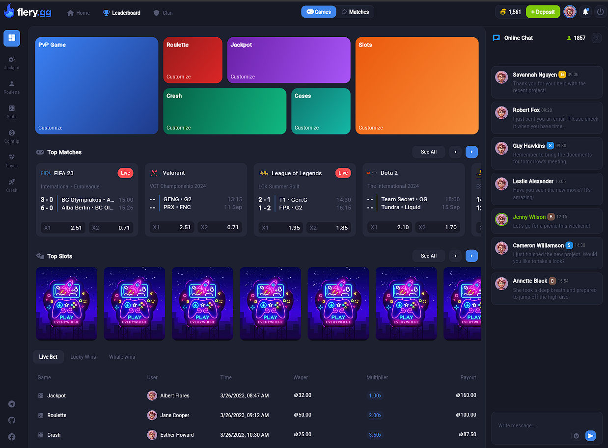
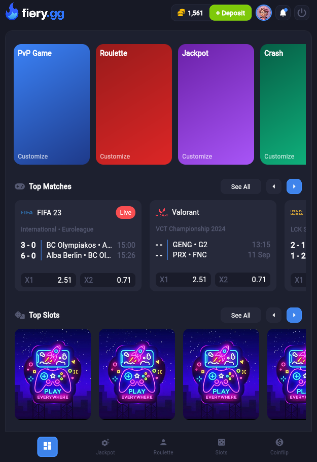

# FieryGG - Flutter Dribble UI Demo


FieryGG is a UI demo project built with Flutter, inspired by a design on Dribbble. This project showcases the ability to create beautiful and responsive user interfaces using Flutter.

## UI by SokStudio  


## Screenshots





## Live Demo

You can view the live demo of the project here: [Live Demo](https://tilarnaexedilica.github.io/FieryGG---Flutter-Dribble-UI-Demo/)

## Installation

1. Make sure you have the Flutter SDK installed on your computer.
2. Clone this repository:

   ```bash
   git clone https://github.com/TilarnaExdilika/FieryGG---Flutter-Dribble-UI-Demo
   ```

3. Navigate to the project directory:

   ```bash
   cd FieryGG-Flutter-Dribble-UI-Demo
   ```

4. Install dependencies:

   ```bash
   flutter pub get
   ```

5. Run the app:

   ```bash
   flutter run
   ```

## Project Structure

The project is organized as follows:

```bash
fiery_gg/
├── lib/
│   ├── ui/
│   │   ├── dashboard.dart
│   │   └── splash.dart
│   ├── config/
│   ├── models/
│   └── main.dart
├── assets/
│   ├── images/
│   └── fonts/
└── pubspec.yaml
```

## Dependencies

The project uses the following packages:

- flutter
- cupertino_icons
- font_awesome_flutter
- url_launcher

## Contact

If you have any questions or suggestions, please feel free to reach out:

[](https://github.com/TilarnaExedilica) Github: TilarnaExedilica

[](https://www.facebook.com/IShino.Avery/) Pham Anh

---

Thank you for your interest in the  project!
